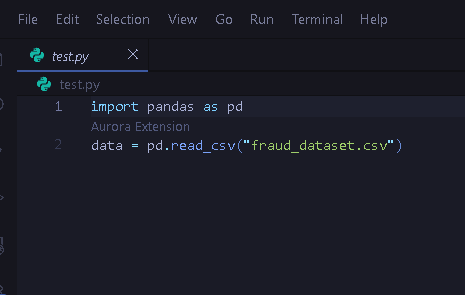
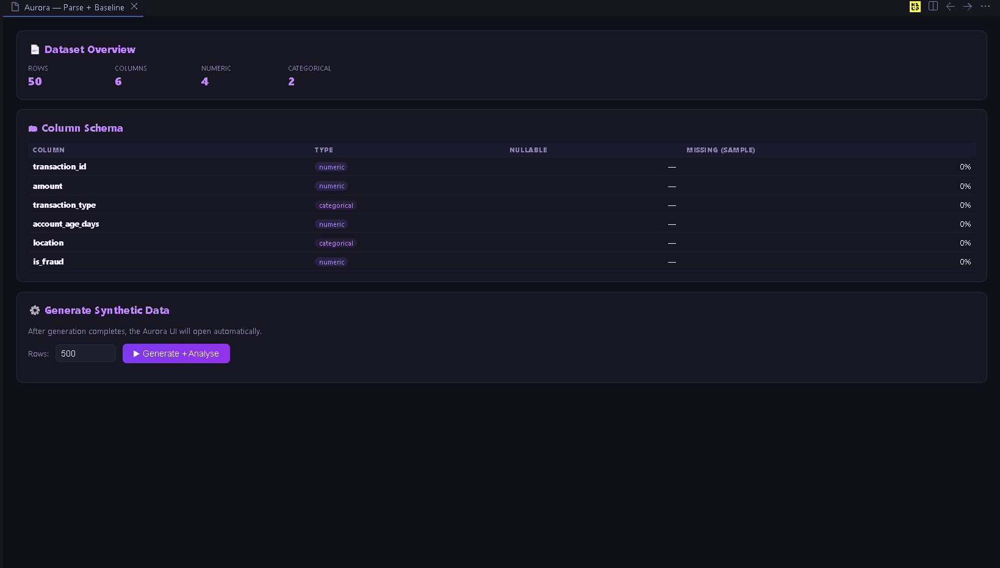
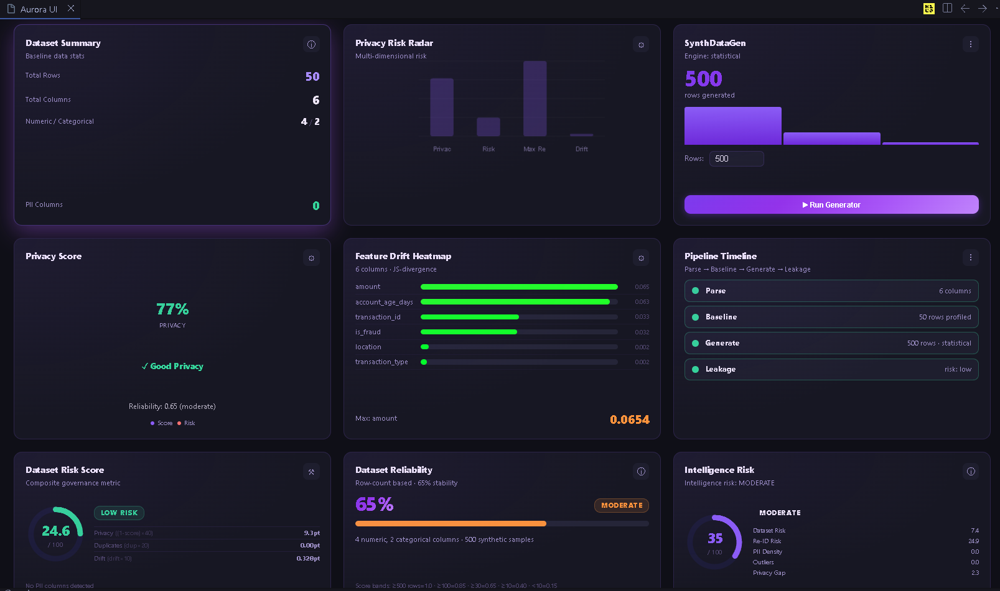
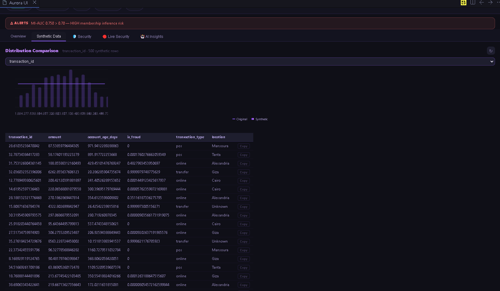
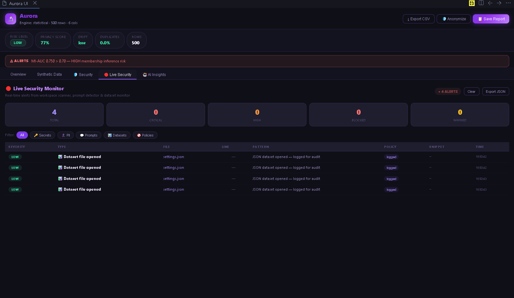
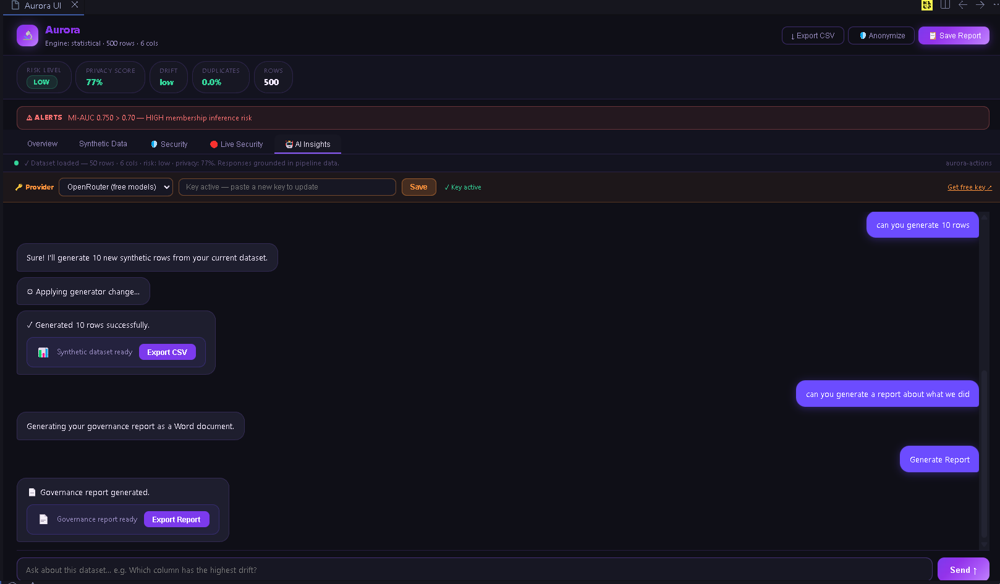

<div align="center">

```
   ___
  / _ | __ __ ____ ___  ____  ___ _
 / __ |/ // // __// _ \/ __/ / _ `/
/_/ |_|\_,_//_/   \___/_/    \_,_/
```

### **AI Data Privacy & Governance — VS Code Extension**

<br/>

[](https://code.visualstudio.com/)
[](https://www.typescriptlang.org/)
[](https://python.org/)
[](https://webpack.js.org/)
[]()
[](LICENSE)
[]()
[]()

<br/>

> Aurora detects dataset imports inline, builds statistical baselines, generates privacy-safe synthetic data, scans for PII & secrets, simulates re-identification attacks, and delivers AI-powered governance insights — **all without leaving your editor.**

<br/>

[Features](#-features) · [How It Works](#%EF%B8%8F-how-it-works) · [Synthetic Pipeline](#-hardened-synthetic-pipeline) · [Screenshots](#-screenshots) · [Installation](#-installation) · [Configuration](#-configuration) · [Architecture](#-architecture) · [Roadmap](#-roadmap)

</div>

---

## ✨ Features

| | Feature | Description |
|---|---|---|
| 🔍 | **Inline CodeLens Detection** | Spots `pd.read_csv`, `read_excel`, `read_json`, `read_parquet`, and `spark.read` calls and places an action button directly above the line |
| 📊 | **Dataset Explorer** | Extracts schema, column types, null ratios, sample values, and a SHA-256 fingerprint — parsed on demand, no full load required |
| 🧠 | **Behavioral Baseline** | Builds a full statistical contract: quantile profiles, IQR, Pearson, Cramér's V, point-biserial correlations, and auto-generated constraint rules |
| ⚗️ | **Synthetic Data Generation** | Three engines auto-selected by dataset size — Statistical (< 1k rows), Gaussian Copula (1k–50k), CTGAN (50k+) — all locally, no data leaves your machine |
| ✅ | **3-Stage Validation Pipeline** | Every generated batch passes through constraint repair → quality filtering → exact deduplication via SHA-256 row hashing before being accepted |
| 🔒 | **Enforcement Layer** | Multi-gate hard-fail pipeline: invariant checks → metric gates → sanity guards → overfitting detection → diversity checks → leakage gate → final decision |
| 🛡️ | **Immutability & Integrity** | Checkpoints are sealed and frozen after generation; SHA-256 content hash asserts `validated_data === returned_data` before any output is released |
| 🚦 | **Backpressure Control** | Execution controller caps concurrent runs and enforces a bounded FIFO queue — prevents system collapse under load |
| 🔑 | **Signed Cache Security** | All model cache files are HMAC-SHA256 signed and whitelist-unpickled — no raw `pickle.load()` anywhere in the codebase |
| 📡 | **Live Checkpoint Monitor** | Real-time panel polls generation progress every 2 seconds — progress bar, per-round stats, warnings, and sample rows as they appear |
| 🛡️ | **PII & Secrets Scanner** | Scans datasets for personally identifiable information and exposed secrets before they leak downstream |
| ⚠️ | **Privacy Attack Simulation** | Models re-identification attack paths including quasi-identifier linkage, cross-dataset correlation, and synthetic data memorization |
| 🤖 | **AI Governance Analyst** | Connects to 6 LLM providers via OpenRouter to deliver plain-language privacy insights, mitigation strategies, and full governance reports |
| 📋 | **Dataset Card Generator** | Auto-generates structured documentation for any analyzed dataset |

---

## ⚙️ How It Works

Aurora orchestrates a **TypeScript VS Code extension** and a **Python data pipeline**. The two layers communicate via `child_process.spawn` — no server, no network round-trips, no data leaving your machine.

```
Your Python file
       │
       │  pd.read_csv("train.csv")   ← Aurora CodeLens appears here
       ▼
  parse.py        →  schema, preview, SHA-256 fingerprint
       │
       ▼
  baseline.py     →  quantile profiles, correlations, constraints, rule set
       │
       ▼
  generator.py    →  execution slot → engine selection → label-first sampling
       │
       ▼
  validation.py   →  3-stage gate: constraint repair → quality filter → dedup
       │
       ▼
  enforcement     →  invariants → metric gate → overfitting → diversity → leakage
       │
       ▼
  checkpoint.py   →  seal → freeze → SHA-256 hash → peek for validation
       │
       ▼
  final_decision  →  single authority gate → guarded export → OutputController
       │
       ▼
  audit_logger    →  structured JSONL log → drift_store snapshot
```

---

## 🔒 Hardened Synthetic Pipeline

The synthetic data pipeline was hardened to production-grade enforcement in a complete security and integrity overhaul. The pipeline now provides the following guarantees:

### Execution Order (Strict, Non-Bypassable)

```
generate()
    │
    ├─ [BACKPRESSURE]   pipeline_slot — semaphore + FIFO queue
    │
    ├─ [DETERMINISM]    seed_manager.init() — reproducible RNG
    │
    ├─ [ENGINE]         StatisticalEngine / ProbabilisticEngine / CTGANEngine
    │
    ├─ [ROUNDS]         ValidationLayer retry loop → CheckPoint.commit()
    │
    ├─ [SEAL]           CheckPoint.seal() — no more writes
    │
    ├─ [FREEZE]         CheckPoint.freeze() — mutation window closed
    │         commit() / reset() raise RuntimeError after this point
    │
    ├─ [GATE 1]         enforcement_engine.enforce_contract()
    │
    ├─ [HASH]           pre_validation_hash = cp.content_hash()  (SHA-256)
    │
    ├─ [READ]           validation_records = cp.peek()  (requires frozen)
    │
    ├─ [GATE 2]         EnforcementEngine.run_post_stage()
    │         ├─ system_invariants  (NaN/Inf, schema, type safety)
    │         ├─ sanity_guard       (collapse, invented values)
    │         ├─ metric_gate        (threshold enforcement)
    │         ├─ overfitting_detector (JS-divergence, corr-diff, mode collapse)
    │         └─ diversity_guard    (entropy check, unique ratio)
    │
    ├─ [GATE 3]         evaluation_pipeline.evaluate()  (independent audit)
    │
    ├─ [GATE 4]         enforce_leakage()  (duplicates / privacy / MI-AUC)
    │
    ├─ [GATE 5]         final_decision()  (single authority, before I/O)
    │
    ├─ [EXPORT]         export_guarded()  (only after all gates pass)
    │
    ├─ [ASSERT]         post_export_hash = cp.content_hash()
    │         if pre != post → PipelineHardFail("DATA DIVERGENCE DETECTED")
    │
    ├─ [ORIGIN TAG]     tag_generated_rows()  (_origin="generated")
    │
    ├─ [DRIFT]          drift_store.compare_and_record()
    │
    └─ [RELEASE]        OutputController.release()  — SINGLE EXIT POINT
```

### Invariants Guaranteed

| Guarantee | Mechanism |
|-----------|-----------|
| `NO RESULT` unless all gates pass | `PipelineHardFail` propagates — no silent catch |
| `validated_data === returned_data` | SHA-256 hash assertion before release |
| No post-validation mutation | `CheckPoint.freeze()` blocks all writes |
| No arbitrary code from cache | HMAC-SHA256 signed + whitelist `_RestrictedUnpickler` |
| No structural overfitting | JS-divergence, correlation diff, unique-ratio gates |
| No distribution collapse | Shannon entropy gate per column |
| No feedback loop contamination | `_origin` tag + `check_origin_purity()` at training |
| No uncontrolled concurrency | Semaphore(3) + bounded FIFO queue(10) |
| Cross-run drift detectable | `drift_store` snapshots every run, hard fail at JS > 0.55 |
| Deterministic reproduction | Global seed chain recorded in audit log |
| Single exit point | `OutputController.release()` — only authorized return |

### New Modules Added

| Module | Purpose |
|--------|---------|
| `pipeline_errors.py` | Typed `PipelineHardFail` hierarchy |
| `system_invariants.py` | NaN/Inf, schema, type-safety hard checks |
| `metric_gate.py` | Threshold enforcement on all computed metrics |
| `sanity_guard.py` | Logical sanity checks (collapse, invented values) |
| `audit_logger.py` | Structured JSONL logging per run |
| `leakage_gate.py` | Privacy enforcement (duplicates / privacy score / MI-AUC) |
| `final_decision.py` | Single-authority pre-export decision gate |
| `output_controller.py` | Anti-bypass: single authorized exit point |
| `enforcement_engine.py` | Central orchestrator for all per-stage checks |
| `evaluation_pipeline.py` | Independent post-generation audit evaluator |
| `seed_manager.py` | Global RNG seed management and reproducibility |
| `config_snapshot.py` | Immutable run configuration snapshot |
| `pipeline_contract.py` | Clause-based contract accumulation and enforcement |
| `signed_pickle_loader.py` | HMAC-SHA256 signed cache I/O + restricted unpickler |
| `overfitting_detector.py` | JS-divergence, correlation diff, mode collapse detection |
| `execution_controller.py` | Semaphore + FIFO queue backpressure system |
| `diversity_guard.py` | Entropy collapse detection + origin tagging |
| `drift_store.py` | Cross-run JSONL snapshot store + temporal drift detection |
| `test_enforcement_proof.py` | 9 automated proof tests for enforcement invariants |
| `test_hardening_proof.py` | 6 automated proof tests for security/robustness |

### Proof Tests (Automated)

All invariants are verified by an automated proof suite that must pass **15/15** before any pipeline output is trusted.

```
Enforcement Proof (9 tests):
  PASS  NaN injection blocked
  PASS  Duplicate explosion blocked
  PASS  Schema break blocked
  PASS  Evaluation FAIL hard gate
  PASS  Export guarded on contract failure
  PASS  OutputController blocked on failed contract
  PASS  Post-freeze mutation blocked
  PASS  peek() requires freeze
  PASS  Identity assertion catches divergence

Hardening Proof (6 tests):
  PASS  Malicious pickle -> SecurityError (unsigned file rejected)
  PASS  Overfitting dataset -> PipelineHardFail
  PASS  High concurrency -> queue limit enforced
  PASS  Low entropy dataset -> collapse detection
  PASS  Feedback loop reuse -> blocked
  PASS  HMAC tamper detection -> SecurityError
```

---

## 📸 Screenshots

### CodeLens Detection

Aurora activates silently when you open a Python file and places a button directly above any dataset loading call — no setup required.

<div align="center">
  
  <br/>
  <sub>Aurora's inline CodeLens trigger, detected above <code>pd.read_csv("fraud_dataset.csv")</code></sub>
</div>

<br/>

### Dataset Explorer — Parse + Baseline

Click the CodeLens button and Aurora immediately opens a structured panel showing your dataset's schema, column types, null rates, and a "Generate + Analyse" action with configurable row count.

<div align="center">
  
  <br/>
  <sub>Dataset Overview for a fraud detection dataset — 50 rows, 6 columns — with the synthetic generation launcher</sub>
</div>

<br/>

### Aurora Dashboard — Overview

The Aurora UI is a full multi-tab dashboard covering synthetic data, security analysis, live monitoring, and AI insights in a single panel inside VS Code.

<div align="center">
  
  <br/>
  <sub>The Aurora Privacy Dashboard — the central hub for all analysis views</sub>
</div>

<br/>

### Synthetic Data Tab — Distribution Comparison

After generation, Aurora renders a side-by-side distribution comparison between original and synthetic data, with a full scrollable table of the generated rows.

<div align="center">
  
  <br/>
  <sub>Distribution comparison for <code>transaction_id</code> — 500 synthetic rows generated. The <strong>MI-AUC alert</strong> at the top flags a high membership inference risk.</sub>
</div>

<br/>

### Security Analysis Tab

<div align="center">
  
  <br/>
  <sub>The Security tab — PII detection, re-identification risk scores, and policy evaluation</sub>
</div>

<br/>

### AI Insights — Governance Analyst

The AI Insights tab connects to your chosen LLM provider and lets you ask natural-language questions about your dataset's privacy risk, column classifications, and governance posture.

<div align="center">
  
  <br/>
  <sub>The AI Governance Analyst — conversational privacy analysis powered by your LLM provider of choice</sub>
</div>

---

## 🛠 Installation

### Prerequisites

- **Node.js** ≥ 18
- **Python** ≥ 3.10
- **VS Code** ≥ 1.70.0
- An API key for at least one supported LLM provider *(optional — required for AI Insights only)*

### Steps

```bash
# 1. Clone the repository
git clone https://github.com/your-org/aurora.git
cd aurora

# 2. Install Node dependencies
npm install

# 3. Install Python dependencies
pip install -r requirements.txt

# 4. Compile the extension
npm run compile
```

Then open the project folder in VS Code and press **F5** to launch the Extension Development Host. The Aurora extension activates automatically when you open any Python file.

---

## ⚙️ Configuration

### LLM Provider Setup

Aurora supports six LLM providers for the AI Insights feature. Set your key via the in-app provider selector or through environment variables:

| Provider | Environment Variable |
|---|---|
| OpenRouter | `OPENROUTER_API_KEY` |
| OpenAI | `OPENAI_API_KEY` |
| Anthropic | `ANTHROPIC_API_KEY` |
| Groq | `GROQ_API_KEY` |
| Together AI | `TOGETHER_API_KEY` |
| Mistral | `MISTRAL_API_KEY` |

Keys entered in the AI Insights panel are stored per-provider in VS Code workspace state and persist across sessions.

### Cache Security (Optional)

Model cache files are HMAC-SHA256 signed automatically. To use a persistent key across restarts, set:

```bash
export AUTOMATE_CACHE_KEY=<64 hex chars>   # e.g. openssl rand -hex 32
```

Without this, a per-session key is generated and stored in `cache/.cache_hmac_key` with owner-only permissions.

### Backpressure Tuning (Optional)

| Environment Variable | Default | Description |
|---|---|---|
| `AUTOMATE_MAX_CONCURRENT` | `3` | Max parallel generation runs |
| `AUTOMATE_QUEUE_TIMEOUT` | `60` | Seconds to wait for a free slot |
| `AUTOMATE_MAX_QUEUE_DEPTH` | `10` | Max queued requests before rejection |

### VS Code Settings

| Setting | Default | Description |
|---|---|---|
| `idelense.pythonPath` | `python3` | Path to the Python executable used to run pipeline scripts |
| `idelense.pipelinePath` | `""` | Absolute path to the extension root directory. Leave empty to auto-discover. |
| `automate.openrouterApiKey` | `""` | OpenRouter API key for free-tier LLM access |

---

## 🏗 Architecture

### Platform Layers

Aurora's platform is a 15-layer governance stack. The LLM interprets the structured outputs of these layers — it never processes raw data directly.

| # | Layer | Responsibility |
|---|---|---|
| 1 | **Data Ingestion** | Collects datasets from files, databases, lakes, APIs, and streams |
| 2 | **Data Catalog** | Indexes schemas, metadata, and dataset ownership |
| 3 | **Data Profiling** | Computes distributions, cardinality, null rates, and column types |
| 4 | **Schema Intelligence** | Detects semantic meaning of columns and identifier types |
| 5 | **Sensitive Data Detection** | Identifies PII and sensitive attributes |
| 6 | **Data Quality** | Detects duplicates, schema drift, inconsistencies, and missing values |
| 7 | **Privacy Risk Engine** | Evaluates privacy exposure and re-identification risk scores |
| 8 | **Re-Identification Modeling** | Analyzes attribute combinations that could identify individuals |
| 9 | **Synthetic Data Risk Detection** | Detects memorization and privacy leakage in generated datasets |
| 10 | **Statistical Reliability Analysis** | Measures confidence and stability of dataset metrics |
| 11 | **Data Lineage** | Tracks dataset origins, transformations, and downstream usage |
| 12 | **Governance Policy Engine** | Evaluates governance rules and produces policy decisions |
| 13 | **Policy Authoring** | Defines sharing restrictions, anonymization requirements, and access policies |
| 14 | **Access Control & Compliance** | Enforces regulatory frameworks such as GDPR |
| 15 | **Monitoring & Audit** | Tracks usage events, policy violations, and governance decisions |

### Synthetic Pipeline Architecture Diagram

```
┌─────────────────────────────────────────────────────────────────────┐
│                         generate()  PUBLIC API                      │
│                                                                     │
│  ┌──────────────┐   Raises PipelineHardFail if queue full/timeout  │
│  │ BACKPRESSURE │──────────────────────────────────────────────────│
│  │ Semaphore(3) │                                                   │
│  │  Queue(10)   │                                                   │
│  └──────┬───────┘                                                   │
│         │                                                           │
│         ▼                                                           │
│  ┌──────────────┐   seed_manager.init()                            │
│  │  DETERMINISM │   root_rng, resolved_seed → config_snapshot      │
│  └──────┬───────┘                                                   │
│         │                                                           │
│         ▼                                                           │
│  ┌──────────────┐   Auto-selected by row count                     │
│  │    ENGINE    │   < 1k    → StatisticalEngine                    │
│  │   ROUTER     │   1k–50k  → ProbabilisticEngine (Gaussian Copula)│
│  │              │   > 50k   → CTGANEngine                          │
│  │              │   Cache I/O via signed_pickle_loader (HMAC-SHA256)│
│  └──────┬───────┘                                                   │
│         │                                                           │
│         ▼                                                           │
│  ┌──────────────────────────────────────────┐                      │
│  │          VALIDATION RETRY LOOP           │                      │
│  │                                          │                      │
│  │  engine.sample()                         │                      │
│  │       │                                  │                      │
│  │       ▼                                  │                      │
│  │  ValidationLayer.run()                   │                      │
│  │  ├─ ConstraintRepair                     │  repeat up to        │
│  │  ├─ QualityFilter                        │  MAX_ROUNDS=8        │
│  │  └─ DuplicatePreFilter (SHA-256 dedup)   │                      │
│  │       │                                  │                      │
│  │       ▼                                  │                      │
│  │  EnforcementEngine.run_post_stage()      │                      │
│  │  ├─ system_invariants (NaN/Inf/schema)   │                      │
│  │  ├─ sanity_guard      (logic checks)     │                      │
│  │  ├─ metric_gate       (thresholds)       │                      │
│  │  ├─ overfitting_detector                 │                      │
│  │  │   ├─ JS-divergence vs baseline        │                      │
│  │  │   ├─ correlation matrix diff          │                      │
│  │  │   └─ unique-ratio / mode collapse     │                      │
│  │  └─ diversity_guard (entropy per column) │                      │
│  │       │                                  │                      │
│  │       ▼                                  │                      │
│  │  CheckPoint.commit()                     │                      │
│  └──────────────────────────────────────────┘                      │
│         │                                                           │
│         ▼                                                           │
│  ┌──────────────┐                                                   │
│  │    SEAL &    │   CheckPoint.seal()   → status="complete"        │
│  │    FREEZE    │   CheckPoint.freeze() → _frozen=True             │
│  │              │   commit()/reset() raise RuntimeError after this  │
│  └──────┬───────┘                                                   │
│         │                                                           │
│         ▼                                                           │
│  ┌──────────────┐                                                   │
│  │  GATE 1      │   enforcement_engine.enforce_contract()           │
│  │  CONTRACT    │   All per-round clauses must be satisfied         │
│  └──────┬───────┘                                                   │
│         │                                                           │
│         ▼                                                           │
│  ┌──────────────┐                                                   │
│  │  CONTENT     │   pre_validation_hash = cp.content_hash()        │
│  │  HASH (pre)  │   SHA-256 of canonical frozen JSON               │
│  └──────┬───────┘                                                   │
│         │                                                           │
│         ▼                                                           │
│  ┌──────────────┐                                                   │
│  │  PEEK        │   validation_records = cp.peek()                 │
│  │  (read-only) │   Requires _frozen=True — raises if not frozen   │
│  └──────┬───────┘                                                   │
│         │                                                           │
│         ▼                                                           │
│  ┌──────────────┐                                                   │
│  │  GATE 2      │   evaluation_pipeline.evaluate()                 │
│  │  EVALUATION  │   Independent audit on validation_records         │
│  │              │   verdict=FAIL → PipelineHardFail                │
│  │              │   verdict=ERROR → PipelineHardFail               │
│  └──────┬───────┘                                                   │
│         │                                                           │
│         ▼                                                           │
│  ┌──────────────┐                                                   │
│  │  GATE 3      │   enforce_leakage()                              │
│  │  LEAKAGE     │   duplicates_rate > 0.10 → PipelineHardFail      │
│  │              │   privacy_score   < 0.50 → PipelineHardFail      │
│  │              │   MI-AUC          > 0.75 → PipelineHardFail      │
│  └──────┬───────┘                                                   │
│         │                                                           │
│         ▼                                                           │
│  ┌──────────────┐                                                   │
│  │  GATE 4      │   final_decision()  — SINGLE AUTHORITY           │
│  │  FINAL       │   Called BEFORE any I/O                          │
│  │  DECISION    │   All preceding gates must be PASS               │
│  └──────┬───────┘                                                   │
│         │                                                           │
│         ▼                                                           │
│  ┌──────────────┐                                                   │
│  │  GATE 5      │   export_guarded(cp, contract_result)            │
│  │  GUARDED     │   cp.export() ONLY after all gates pass          │
│  │  EXPORT      │                                                   │
│  └──────┬───────┘                                                   │
│         │                                                           │
│         ▼                                                           │
│  ┌──────────────┐                                                   │
│  │  IDENTITY    │   post_export_hash = cp.content_hash()           │
│  │  ASSERTION   │   if pre != post → PipelineHardFail              │
│  │  (SHA-256)   │       "DATA DIVERGENCE DETECTED"                 │
│  └──────┬───────┘                                                   │
│         │                                                           │
│         ▼                                                           │
│  ┌──────────────┐                                                   │
│  │  ORIGIN TAG  │   tag_generated_rows(_origin="generated")        │
│  │  (C05)       │   Prevents silent feedback loop re-use           │
│  └──────┬───────┘                                                   │
│         │                                                           │
│         ▼                                                           │
│  ┌──────────────┐                                                   │
│  │  DRIFT       │   drift_store.compare_and_record()               │
│  │  TRACKING    │   JS-divergence vs previous run snapshot         │
│  │  (M03)       │   warn > 0.25, hard fail > 0.55                  │
│  └──────┬───────┘                                                   │
│         │                                                           │
│         ▼                                                           │
│  ┌──────────────┐                                                   │
│  │  SINGLE EXIT │   OutputController.release()                     │
│  │              │   Belt-and-suspenders final_decision() re-check  │
│  │              │   The ONLY authorized return statement            │
│  └──────────────┘                                                   │
└─────────────────────────────────────────────────────────────────────┘
```

### Project Structure

```
aurora/
├── src/
│   ├── ai/
│   │   ├── openrouter_client.ts        # Multi-provider LLM client + governance system prompt
│   │   ├── agent.ts                    # Agent chat logic and conversation management
│   │   └── dataset_context_builder.ts  # Structured context injected into LLM prompts
│   ├── security/
│   │   ├── prompt_scanner.ts           # Prompt leakage detection
│   │   ├── realtime_scanner.ts         # Live PII/secrets scanning
│   │   └── alert_store.ts              # Alert state management
│   ├── webview/
│   │   └── ui/
│   │       ├── agent.ts                # AI Insights chat panel
│   │       ├── charts.ts               # Dashboard charts and visualizations
│   │       ├── overview.ts             # Overview tab
│   │       ├── security.ts             # Security analysis tab
│   │       ├── synthetic.ts            # Synthetic data tab
│   │       └── livesecurity.ts         # Live security monitoring tab
│   ├── utils/
│   │   ├── generator.py                # Pipeline entry point + engine router
│   │   ├── checkp.py                   # Atomic checkpoint store (seal/freeze/hash)
│   │   ├── validation.py               # 3-stage ValidationLayer
│   │   ├── enforcement_engine.py       # Central enforcement orchestrator
│   │   ├── pipeline_errors.py          # Typed PipelineHardFail hierarchy
│   │   ├── system_invariants.py        # NaN/Inf/schema hard checks
│   │   ├── metric_gate.py              # Metric threshold enforcement
│   │   ├── sanity_guard.py             # Logical sanity checks
│   │   ├── leakage_gate.py             # Privacy leakage hard gate
│   │   ├── final_decision.py           # Single authority pre-export gate
│   │   ├── output_controller.py        # Anti-bypass single exit point
│   │   ├── evaluation_pipeline.py      # Independent post-gen audit
│   │   ├── signed_pickle_loader.py     # HMAC-SHA256 signed cache I/O
│   │   ├── overfitting_detector.py     # JS-divergence + mode collapse detection
│   │   ├── execution_controller.py     # Semaphore + FIFO queue backpressure
│   │   ├── diversity_guard.py          # Entropy collapse + origin tagging
│   │   ├── drift_store.py              # Cross-run temporal drift tracking
│   │   ├── audit_logger.py             # Structured JSONL audit logging
│   │   ├── pipeline_contract.py        # Clause-based contract accumulation
│   │   ├── seed_manager.py             # Global RNG seed management
│   │   ├── config_snapshot.py          # Immutable run configuration snapshot
│   │   ├── test_enforcement_proof.py   # 9 enforcement invariant proof tests
│   │   └── test_hardening_proof.py     # 6 security/robustness proof tests
│   └── extension.ts                    # VS Code extension entry point
├── docs/
│   ├── screenshots/                    # UI screenshots
│   └── features/                       # Feature deep-dives
├── policy.yaml                         # Governance policy definitions
├── requirements.txt                    # Python dependencies
├── package.json
└── tsconfig.json
```

---

## 🗺 Roadmap

- [x] Fail-safe enforcement layer with typed PipelineHardFail exceptions
- [x] Immutability gate: CheckPoint.freeze() + SHA-256 identity assertion
- [x] HMAC-SHA256 signed model cache (no raw pickle.load anywhere)
- [x] Structural overfitting detection (JS-divergence, correlation, mode collapse)
- [x] Backpressure control (semaphore + bounded FIFO queue)
- [x] Distribution collapse detection (Shannon entropy per column)
- [x] Feedback loop prevention (origin tagging + purity check)
- [x] Cross-run temporal drift tracking (JSONL snapshot store)
- [x] Automated proof test suites (15 tests, 15/15 passing)

---

## 🤝 Contributing

Contributions are welcome. To get started:

1. Fork the repository
2. Create a feature branch: `git checkout -b feature/your-feature`
3. Commit your changes: `git commit -m "feat: description"`
4. Push to your branch: `git push origin feature/your-feature`
5. Open a pull request against `main`

Please follow the existing code style and include relevant tests. For significant changes, open an issue first to discuss the proposed approach.

---

## 📄 License

This project is licensed under the [MIT License](LICENSE).

---

<div align="center">
  <sub>Built for ML engineers and data scientists who care about privacy.</sub>
</div>
